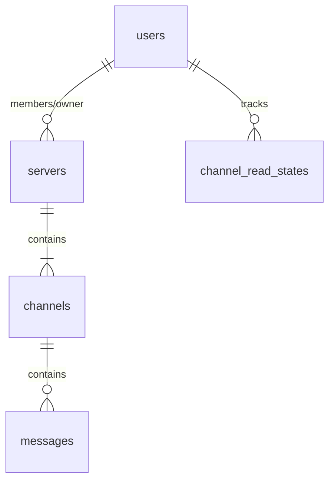

# Cordis Development Progress & Architecture Documentation

This document provides a comprehensive, self-contained guide to the architecture, data structures, communication protocols, file management, and deployment workflows of the **Cordis** chat application.

---

## 1. Directory & Codebase Layout

```
cordis/
├── database.py              # SQLAlchemy database configuration and engine initialization
├── db_models.py             # SQLAlchemy ORM database models mapping table schemas
├── models.py                # Pydantic validation schemas for API inputs & responses
├── storage.py               # Cloudflare R2 / Local file upload logic & fallback handler
├── main.py                  # FastAPI core application, API endpoints, and WebSocket controller
├── requirements.txt         # Python dependencies
├── start.sh                 # Production background execution script (nohup + uvicorn)
├── init-postgresql.sh      # Shell script to install and initialize PostgreSQL database
├── chat.db                  # Local dev SQLite database (ignored by git)
├── uploads/                 # Local directory for media storage fallback (ignored by git)
└── frontend/                # React SPA
    ├── src/
    │   ├── App.tsx          # Main React Application (chat logic, layouts, socket handlers)
    │   ├── App.css          # App-specific layout CSS
    │   ├── index.css        # Global CSS stylesheet & primary Discord-inspired theme variables
    │   └── main.tsx         # React root mounting script
    ├── package.json         # Node dependencies (React 19, Lucide icons, Vite)
    └── vite.config.ts       # Vite build configurations
```

---

## 2. Environment Configuration

### Backend `.env` (Project Root)
| Variable Name | Description | Default / Fallback |
| :--- | :--- | :--- |
| `SECRET_KEY` | Key for signing JWT access tokens. | `"super-secret-key-..."` |
| `JWT_ALGORITHM` | Algorithm used for JWT encoding. | `"HS256"` |
| `ACCESS_TOKEN_EXPIRE_MINUTES` | Token lifespan in minutes. | `10080` (1 week) |
| `DATABASE_URL` | SQLAlchemy connection string. | `"sqlite:///./chat.db"` |
| `R2_ACCESS_KEY_ID` | Cloudflare R2 Client Access Key ID. | *None* (Forces Local Fallback) |
| `R2_SECRET_ACCESS_KEY` | Cloudflare R2 Secret Access Key. | *None* (Forces Local Fallback) |
| `R2_ENDPOINT_URL` | Cloudflare R2 S3-compatible API endpoint. | *None* (Forces Local Fallback) |
| `R2_BUCKET_NAME` | Target Cloudflare R2 Bucket name. | *None* (Forces Local Fallback) |
| `R2_PUBLIC_URL` | Public HTTP URL prefix mapping to the bucket. | *None* (Forces Local Fallback) |

### Frontend `.env` (`frontend/` Directory)
| Variable Name | Description | Default / Fallback |
| :--- | :--- | :--- |
| `VITE_API_BASE` | HTTP protocol endpoint of the FastAPI backend. | `"http://127.0.0.1"` |

*Note: The WebSocket URL (`ws://...`) is dynamically derived on the client by replacing the `http` prefix in `VITE_API_BASE` with `ws`.*

---

## 3. Database Schema & ID Generation

The database is built on SQLAlchemy models in [db_models.py](file:///c:/Users/ryanj/KSF/cordis/db_models.py) and validated via Pydantic schemas in [models.py](file:///c:/Users/ryanj/KSF/cordis/models.py).



### Table Schemas

1.  **Users (`users` table)**:
    *   `user_id` (Int, PK, Auto-increment): Unique User ID.
    *   `username` (String, Indexed, Unique): User's unique handle.
    *   `hashed_password` (String): Secure password hashed using `bcrypt`.
    *   `permissions` (JSON): String array of permission flags.
    *   `status` (String): Custom active status description.
    *   `description` (String): Profile "About Me" biography.
    *   `profile_picture` (String): Image URL or relative path (e.g. `/uploads/...`).
    *   `banner` (String): Banner header image URL or path.

2.  **Servers (`servers` table)**:
    *   `server_id` (Int, PK, Auto-increment): Unique Server ID.
    *   `server_name` (String): Server display name.
    *   `server_description` (String): Core description.
    *   `server_image` (String): Server profile image URL/path.
    *   `server_banner` (String): Server background banner image.
    *   `members` (JSON): Integer array of associated User IDs.
    *   `folders` (Int): Parent navigation folder assignment.
    *   `channels` (Int): Total channel counting index.
    *   `invite_code` (String, Unique, Indexed): Random string for join actions.
    *   `is_public` (Boolean): Discovery visibility settings.
    *   `owner_id` (Int, Indexed): User ID of the server owner.

3.  **Channels (`channels` table)**:
    *   `channel_id` (Int, PK, Auto-increment): Unique Channel ID.
    *   `server_id` (Int): Associated Server ID (`null` for DM channels).
    *   `channel_name` (String): Name display (e.g. `"general"`).
    *   `channel_type` (String): Type descriptor (`"TEXT"` or `"dm"`).
    *   `members` (JSON): Integer array of member User IDs.

4.  **Messages (`messages` table)**:
    *   `message_id` (Int, PK): Unique message identifier (random 7-digit integer).
    *   `channel_id` (Int, Indexed): Target channel.
    *   `author_id` (Int, Indexed): Sender's User ID.
    *   `content` (JSON): Structured payload detailing:
        *   `text` (String): Message text.
        *   `attachments` (Array of Strings): Static attachment image/file URLs.
        *   `embeds` (Array of Objects): Structured rich embeds.
    *   `mentions` (JSON): Integer array of mentioned User IDs.
    *   `flags` (JSON): Array of string markers.
    *   `reactions` (JSON): Nested list mapping reactions: `[{"emoji": "🔥", "count": 1, "user_ids": [1]}]`.
    *   `created_at` (Int) / `modified_at` (Int): Epoch Unix timestamps.
    *   `message_type` (String): Mode string (default: `"DEFAULT"`).
    *   `parent_id` (Int) / `thread_id` (Int): Thread indexing (0 if main channel).

5.  **Channel Read States (`channel_read_states` table)**:
    *   `id` (Int, PK, Auto-increment): Read state tracker row index.
    *   `user_id` (Int, Indexed): Target User ID.
    *   `channel_id` (Int, Indexed): Target Channel ID.
    *   `last_read_message_id` (Int): Highest message ID read by the user in this channel.

### ID & Code Generation Strategies
*   **Sequential Entities (Users, Servers, Channels)**: Standard auto-increment integer identifiers generated automatically by SQLite or PostgreSQL.
*   **Messages**: Server-side generated random 7-digit integers (`random.randint(1000000, 9999999)`) assigned on message creation.
*   **Invite Codes**: Random 6-character strings created via `random.choices(string.ascii_letters + string.digits, k=6)`.

---

## 4. API Endpoints (REST API)

### Authentication & Profiles
*   `POST /register`: Registers a new account.
    *   **Input**: `{"username": "...", "password": "..."}`
    *   **Returns**: User response object (`201 Created`).
*   `POST /login`: Validates password and generates authentication tokens.
    *   **Input**: `{"username": "...", "password": "..."}`
    *   **Returns**: `{"access_token": "...", "token_type": "bearer"}`
*   `GET /users/me`: Retrieves current user profile.
*   `PUT /users/me`: Updates profile details (username, biography description, avatar, banner).
*   `GET /users/{user_id}`: Retrieves profile details of another user.

### Servers & Channels
*   `GET /servers/discover`: Lists all public servers (`is_public = True`).
*   `GET /servers/me`: Retrieves servers the current user is a member of.
*   `POST /servers`: Creates a new server and builds a default text channel named `"general"`.
*   `PUT /servers/{server_id}`: Updates server settings (name, description, image, banner).
*   `DELETE /servers/{server_id}`: Deletes a server (only accessible to the owner).
*   `POST /servers/join`: Joins a server.
    *   **Input**: `{"invite_code": "..."}`
*   `POST /servers/{server_id}/leave`: Leaves a server.
*   `GET /servers/{server_id}/members`: Lists all members of a server.
*   `GET /servers/{server_id}/presence`: Returns list of User IDs online in a server.
*   `GET /servers/{server_id}/channels`: Lists all channels inside a server.
*   `POST /channels`: Creates a text channel inside a server.
*   `GET /channels/{channel_id}/messages`: Fetches the history of messages inside a channel (supports `limit`).

### Direct Messages (DMs)
*   `GET /dms`: Lists active DM channels for the user.
*   `POST /dms`: Starts a new DM channel with a target user (or returns the existing one).
    *   **Input**: `{"target_user_id": ...}`

### Unreads & File Storage
*   `GET /users/me/unreads`: Fetches unread metrics and active mention pings for all user channels.
*   `POST /api/upload`: Uploads files/images.
    *   **Input (Form-data)**: `file` (Binary), `upload_type` (String choice: `"attachments"`, `"avatars"`, or `"banners"`).
    *   **Returns**: `{"url": "..."}`

---

## 5. WebSocket Protocol & Real-time Synchronization

WebSockets facilitate real-time chat, typing states, and status synchronization.

### Connecting to a Channel
A client connects to a channel's socket at the path:
`ws://{hostname}/ws/{channel_id}?token={JWT_TOKEN}`

### The ConnectionManager
Defined in [main.py](file:///c:/Users/ryanj/KSF/cordis/main.py), the connection manager tracks socket channels:
1.  On connection, the backend accepts the socket and tracks it under the channel ID.
2.  It also tracks the socket under the user's User ID to support multi-device session notifications.
3.  If this is the user's first active WebSocket connection, the backend broadcasts a presence update.

### WebSocket Payload Schemas

#### 1. Typing Notification (Client -> Server -> Client)
Sent by the client when typing:
```json
{
  "type": "typing"
}
```
Broadcasted to all other channel members as:
```json
{
  "type": "typing",
  "user_id": 123
}
```

#### 2. Read State Update (Client -> Server)
Sent by the client to update read progression:
```json
{
  "type": "read_update",
  "message_id": 9876543
}
```

#### 3. Standard Chat Message (Client -> Server)
Sent by the client to write a message:
```json
{
  "content": {
    "text": "Hello World!",
    "attachments": ["https://r2-domain.com/attachments/xyz.png"],
    "embeds": []
  },
  "message_type": "DEFAULT",
  "parent_id": 0,
  "thread_id": 0,
  "mentions": [],
  "flags": [],
  "reactions": []
}
```

#### 4. Chat Message Broadcast (Server -> Client)
Sent by the server to broadcast the written message:
```json
{
  "message_id": 9876543,
  "channel_id": 45,
  "server_id": 12,
  "author_id": 123,
  "author": {
    "user_id": 123,
    "username": "alice",
    "permissions": [],
    "status": "online",
    "description": "Code developer",
    "profile_picture": "/uploads/avatars/alice.png",
    "banner": null
  },
  "content": {
    "text": "Hello World!",
    "attachments": ["https://r2-domain.com/attachments/xyz.png"],
    "embeds": []
  },
  "created_at": 1718000000,
  "modified_at": 1718000000,
  "message_type": "DEFAULT",
  "parent_id": 0,
  "thread_id": 0,
  "mentions": [],
  "flags": [],
  "reactions": []
}
```

#### 5. Unread Notification (Server -> Client)
Delivered to a user's active sockets if a new message arrives in a channel they are a member of, but are not actively viewing:
```json
{
  "type": "unread_notification",
  "message_id": 9876543,
  "channel_id": 45,
  "server_id": 12,
  ... // Standard message body continues
}
```

#### 6. Presence Notification (Server -> Client)
Broadcasted to all members of shared channels when a user goes online or offline:
```json
{
  "type": "presence",
  "user_id": 123,
  "status": "online" // "online" or "offline"
}
```

---

## 6. Unreads & Mentions Calculation Workflow

Unreads and mention highlights are evaluated dynamically:
1.  **Read States**: When a user views a channel, the client sends a `read_update` websocket message containing the latest message ID. The database updates `last_read_message_id` for that `(user_id, channel_id)` tuple.
    *   *Chronological Progress*: To resolve issues with legacy random large message IDs, the backend verifies chronological progression. The `last_read_message_id` is only advanced if the newly read message has a greater `created_at` timestamp (or same timestamp and larger `message_id`) than the currently stored read message.
2.  **Mentions Indexing**: On `main.py` message reception:
    *   *Regular Mentions*: The server extracts potential mentions using the regex `re.findall(r'@([a-zA-Z0-9_]+)', text)`. Users who match are loaded from the database, and their user IDs are appended to the message's `mentions` array before saving.
    *   *Reply Mentions*: If the message is a reply (non-zero `parent_id`), the author of the parent message is automatically added to the message's `mentions` array to trigger a reply ping.
3.  **Metrics Query & Pings**: Calling `/users/me/unreads` executes this check:
    *   Loads all channels (server channels + DM channels) the user belongs to.
    *   Fetches the user's `last_read_message_id` for each channel (defaulting to 0 if missing).
    *   Queries all messages in that channel where the message is chronologically newer than the message associated with `last_read_message_id`.
    *   If the result set is not empty, the channel is marked as unread.
    *   *DM Pings*: For Direct Message (DM) channels, any message sent by the other party automatically increments the `mentions_count`.
    *   *Server Mentions*: For server channels, a message only increments `mentions_count` if the current user's ID exists in the message's `mentions` array.
4.  **UI Badges**:
    *   *Red Dot Badge (Pings)*: DM chats and server icons show a red badge indicating the sum of unread mentions.
    *   *DM Sidebar*: When viewing the Direct Messages tab, the sidebar lists each DM conversation with a corresponding red notification badge showing the number of unread mentions from that specific user.
    *   *Dynamic List Update*: If a user receives a DM from a new contact while already viewing the DM page, the frontend intercepts the WS notification and triggers an asynchronous DM list refresh to render the new user in the sidebar immediately.

---

## 7. Storage Engine Configuration (`storage.py`)

Cordis supports dynamic, hot-swappable storage setups:

```
                  ┌──────────────────────┐
                  │ POST /api/upload     │
                  └──────────┬───────────┘
                             │
                  Is R2 configured in .env?
                    /                 \
                 [Yes]                [No]
                  /                     \
       ┌─────────▼─────────┐      ┌──────▼────────────┐
       │ Upload to R2      │      │ Save locally to   │
       │ (boto3 client)    │      │ uploads/ folder   │
       └─────────┬─────────┘      └──────┬────────────┘
                 │                       │
      Return R2 Public URL        Return /uploads/...
```

*   **R2 Engine**: Uses `boto3` client pointing to the custom R2 S3 endpoint, utilizing S3v4 signature protocols with an auto-detected region.
*   **Local fallback**: Saves raw byte strings directly into the local `uploads/` folder and serves them as static assets at `/uploads/` using FastAPI StaticFiles.
*   **Filename Sanitization**: Upload filenames are rewritten using random UUID strings (`uuid.uuid4().hex` + sanitized suffix) to prevent file-name path injection attacks and space character link breakages.
*   **Directory Structure**: Uploaded assets are organized into three folders:
    *   `avatars/`: Icons for server cards and user avatars.
    *   `banners/`: Profile covers and server background banners.
    *   `attachments/`: Direct attachments, images, and documents sent in messages.

---

## 8. Setup & Deployment Operations

We use shell scripts to manage automated production setup and runtime execution on a VPS.

### Database Setup ([init-postgresql.sh](file:///c:/Users/ryanj/KSF/cordis/init-postgresql.sh))
Configures PostgreSQL on clean Ubuntu/Debian platforms:
*   Installs database dependencies (`postgresql` and `postgresql-contrib`).
*   Configures systemd to start and enable PostgreSQL services.
*   Initializes the database `cordis` and user `cordis_user` with a secure password (`ksfWebServices`).
*   Grants appropriate owner permissions.

### Application Control ([start.sh](file:///c:/Users/ryanj/KSF/cordis/start.sh))
Builds frontend assets and handles backend uvicorn service execution:
1.  **Reads Environment**: Loads backend configurations from `.env`.
2.  **Virtual Environments**: Activates local python environments (`venv` or `.venv`).
3.  **Compiles Frontend**: Runs `npm run build` inside `frontend/` to output HTML/JS/CSS assets to `frontend/dist/`. The backend FastAPI app mounts this directory to serve it statically.
4.  **Port Verification**: Searches if another process is listening on port 8000 using `lsof`.
5.  **Execution Lifecycle**: Launches uvicorn in the background using `nohup`, logging to `app.log` and saving the running process ID to `app.pid`.

---

## 9. Recent Implementations & Changelog

### Core Features & UI
*   **Discord-Style Emoji Reactions:** Users can react to messages using a curated mini-picker on hover or a full `emoji-picker-react` interface. Reactions sync in real-time via WebSockets and include Discord-style tooltips showing which users reacted.
*   **Discord-Style Message Hover UI:** Messages feature a full-width subtle tint on hover. The floating message action bar (Reply/Edit/Delete/React) stays pinned if an interaction menu is open and has a clean, uniform design.
*   **Discord-Style Display Names:** Users can configure a separate, human-readable display name independent of their unique system username.
*   **Message Editing & Deletion:** Users can now edit their sent messages and delete them.
*   **Message Replies:** Users can directly reply to specific messages, showing a parent message preview above the new message.
*   **Rich Link Embeds:** Automatically fetches OpenGraph metadata (`og:title`, `og:description`, `og:image`) for shared links asynchronously and renders Discord-style embed cards. Users can wrap links in `< >` to suppress the embed generation.
*   **Message Pings (@mentions):** Added Discord-style `@username` mentions that highlight in blue, bold the text, and allow clicking to open the mentioned user's profile popup.
*   **System Account Integration:** Dedicated "SYSTEM" user account configuration for automated server notifications.
*   **Image Scrolling Fixes:** Chat interface now correctly auto-scrolls to the bottom after images and rich embeds finish loading over the network.
*   **General Server Invites:** Security and flow adjustments to disable generic server invites when not appropriate.

### Infrastructure & Backend
*   **User Last Active Tracking:** Added `last_active_at` timestamp column to the users table to track and calculate "Active Xd ago" user presence metrics.
*   **Image Storage Engine:** Completed full Cloudflare R2 integration using `boto3` alongside an automatic local storage fallback, implementing sanitized UUID filenames for security.
*   **Username Deduplication:** Enforced guardrails preventing duplicate username registration.
*   **PostgreSQL Migration & VPS Deployment:** Added `init-postgresql.sh` and updated `start.sh` for seamless VPS deployment, transitioning from SQLite to PostgreSQL.
